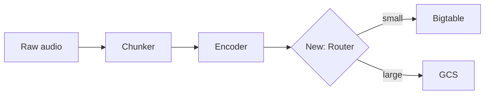
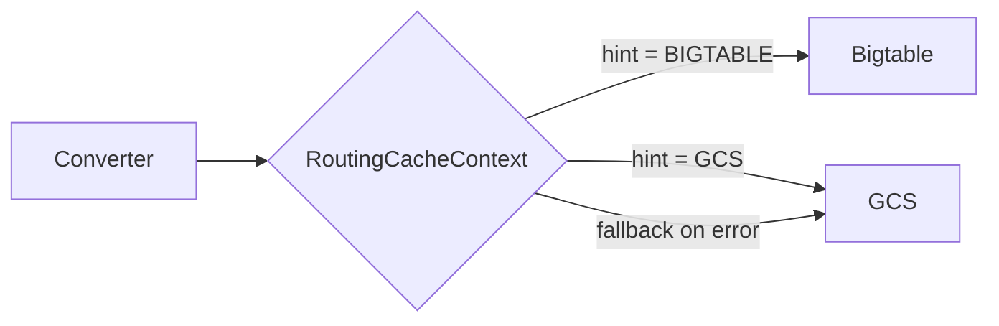

# Creating & updating pull requests

A PR description manages a reviewer's attention. Optimize for review speed: a good description gets the reviewer oriented in 30 seconds and answers "what changed, why, and where do I start reading?" before they open the diff.

# Critical rules

NEVER:
- Add `Co-Authored-By` headers on commits.
- Include "Generated with Claude Code" or any AI/Claude attribution.
- Mention Claude, AI, agents, or assistants anywhere in the PR.

# Load PROSE.md before drafting

If `~/.claude/PROSE.md` exists, read it before writing the description. PR descriptions are prose; the rules there apply directly. Most load-bearing for PRs:

- **Active voice, present tense.** "X overrides Y" not "Y is overridden by X."
- **Omit needless words.** Cut "in order to", "the fact that", hedges like "rather", "quite", "very".
- **Front-load keywords.** Put the most important word in the first two words of each paragraph and header.
- **Bold sparingly (Von Restorff).** One bolded headline per Reviewer-notes bullet. If you bold everything, nothing stands out.
- **Concrete > abstract.** "showed `71 / 113  63%` instead of `71 / 160  44%`" lands harder than "showed an inflated percentage."
- **Paragraphs 2–4 lines.** Long blocks get skipped; one-line fragments fragment.
- **No "In conclusion", "Overall", "In summary".** End with a next step or a final fact.

# Title format

Active voice, present tense, full scope.

| Good | Bad |
|------|-----|
| Add user authentication | Added user authentication |
| Fix memory leak in cache | Fixing memory leak |
| Use Redis cache for session lookup instead of DB query | Update session.py |

Pattern: `<Verb> <what> [in/for/to <context>]`

Common verbs: Add, Fix, Update, Remove, Refactor, Implement, Improve, Replace, Enable, Disable, Use, Make.

# The above-the-fold contract

A reviewer reads top-down and decides where to invest attention. Everything before the first scroll must orient them completely:

1. **Title** → full scope in one line. A reviewer who reads only the title should know what area of the codebase changed and what kind of change it is.
2. **TL;DR** → symptom + fix in two sentences, with a concrete number or example. A reviewer who reads only the TL;DR should be able to approve a low-risk PR without scrolling further.
3. **Files table** → where to start reading and why each file matters. A reviewer who reads the files table should know the review order and what to look for in each file.

If the TL;DR can't fit in two clean sentences, you don't yet understand the PR well enough. Re-read the diff.

# Description template

One template, flexible sections. Use every section that adds value; skip any that doesn't. The rule: **if removing a section wouldn't slow down the reviewer, remove it.**

```markdown
## TL;DR

[Two sentences. First names the problem with a concrete number, error, or example.
Second names what the PR does about it.]

**Files to review (N, +X / -Y):**

| File | Why |
|---|---|
| `path/to/start_here.py` *(start here)* | One-line pointer to the natural entry point. |
| `path/to/other.py` | Short reason this file changed. |

## Why

[Why the PR exists. Show the problem: error messages, wrong output, missing
capability. Use a before/after table or screenshot if the difference is visual
or numeric. Skip this section for PRs where the TL;DR already covers the "why"
completely — don't repeat yourself.]

## How

[The change, top-down. Numbered steps for sequential logic; bullets for parallel
changes. Focus on design decisions, not line-by-line narration.]

## Reviewer notes

[One bullet per non-obvious fact. Bold the headline of each.]

- **Match by `comparison_id`, not model pair.** Tier projects share pairs
  across tests, so matching by model pair would conflate results.
- **Falls back gracefully.** If the API call fails, logs and keeps the
  legacy denominator — no silent breakage.

## Visual aids

[Include when they earn their space. See "When to use visual aids" below.
Mermaid diagrams, before/after tables, code snippets, screenshots.]

## Tests

[What's covered, what isn't, how to run them.]

## Follow-up

[Out-of-scope work this PR sets up. Optional — only if the PR is
deliberately incomplete.]

## Links

- [Ticket](url)
- [Slack thread](url)
```

### Scaling the template

**Small PR (< ~50 lines, one concern):** TL;DR + Why (2–3 sentences) + Links. Skip the files table, Reviewer notes, and Tests unless they add something the diff doesn't show.

**Medium PR (50–200 lines):** TL;DR + files table + Why + How + Links. Add Reviewer notes only for non-obvious tradeoffs.

**Large PR (200+ lines or multiple concerns):** Use every section that applies. The files table and Reviewer notes are mandatory — reviewers need a map.

# Don't repeat the diff

The diff is right there. The description's job is to explain what the diff *can't* show: motivation, tradeoffs, context that lives outside the code.

### Cut these every time

- **File-by-file narration.** "In `foo.py`, changed X. In `bar.py`, changed Y." The files table covers this in one line each; the diff shows the rest.
- **How bullets that re-explain the files table.** If How has per-file bullets that say roughly what the files table already says with more words, cut the bullets. How should state the shared design approach or architecture — the *pattern* across files, not a tour of each one.
- **Implementation play-by-play.** "First, I added a helper function. Then I called it from…" Describe the design, not the steps you took.
- **Motivation the reviewer already knows.** If the ticket/issue fully explains the problem, link it and write one sentence — don't restate the whole ticket.
- **Restating obvious type/signature changes.** "Changed `foo(x: int)` to `foo(x: float)`" — the diff shows this. Say *why* it changed.
- **Defensive disclaimers.** "This is a first pass", "open to suggestions", "not sure if this is the right approach." If you're not sure, figure it out before opening the PR, or put the specific question in Reviewer notes.
- **Commit-message archaeology.** "In the first commit I did X, then in the second commit I did Y." Describe the final state.

### The test: does this sentence exist in the diff?

For every sentence in the description, ask: could a reviewer learn this by reading the diff? If yes, cut it. The description should be the *complement* of the diff, not a summary of it.

# When to use visual aids

Visual aids earn their space when they communicate something faster than prose. Don't decorate — illustrate.

### Before/after tables

Use when the PR changes observable behavior (output format, API response shape, metric values, error messages).

```markdown
| | Before | After |
|---|---|---|
| Progress display | `71 / 113  63%` | `71 / 160  44%` |
| Completion trigger | Fires at 113 annotations | Fires at 160 annotations |
```

### Mermaid diagrams

Use when the PR changes data flow, adds a pipeline stage, or restructures how components interact. Don't diagram things that haven't changed.

````markdown

````

### Code snippets

Use when the PR changes a public API surface and the reviewer needs to see the new call site or signature without hunting through the diff.

````markdown
Before:
```python
result = process(audio, sample_rate=44100)
```

After:
```python
result = process(audio, config=ProcessConfig(sample_rate=44100, normalize=True))
```
````

### Screenshots / terminal output

Use for UI changes, CLI output changes, or log format changes. Paste the image or terminal block directly — don't describe what it looks like in prose.

### When NOT to use visual aids

- The change is purely internal (refactor, rename, test-only). A diagram of unchanged architecture wastes space.
- The "before" state is obvious. A before/after table for a one-line bug fix is overhead.
- You're diagramming the whole system. Scope diagrams to what the PR *changes*, not what it touches.

# Reviewer-friendliness checklist

Before submitting, verify:

- [ ] **Title** → a reviewer who reads only this knows the full scope.
- [ ] **TL;DR** → a reviewer who reads only this knows symptom + fix.
- [ ] **Files table** → marks one file "start here" when there's a natural entry point.
- [ ] **No diff echoing** → every sentence tells the reviewer something the diff can't.
- [ ] **Visual aids** → included where they're faster than prose, absent where they're not.
- [ ] **Reviewer notes** → each one answers a question the reviewer would otherwise stop to ask.

# Process

## 1. Detect: create or update?

```bash
# If a PR exists for this branch, this is an update.
gh pr view --json number,title,body,baseRefName,url 2>/dev/null
```

## 2. Gather context

```bash
BASE=$(gh pr view --json baseRefName -q '.baseRefName' 2>/dev/null || echo "main")

git diff $BASE...HEAD          # full diff — what the PR represents
git diff $BASE...HEAD --stat   # shape: files, +/- counts
git log $BASE..HEAD --oneline  # commits
```

Read the actual diff, not just the stat. The description must reflect what the code does now.

## 3. Find links

Every claim in the description that a reviewer might want to verify ("caused divergence after ~500 steps", "legal flagged the token storage") needs a link. Don't make reviewers take facts on faith.

**Actively search** — don't just ask the user:
1. **Git history.** `git log --all --oneline --grep="keyword"` for related PRs, fix commits, and reverts.
2. **Slack.** Search for error messages, feature names, or incident keywords using `slack_search_public_and_private`. Prefer linking to the thread where the root cause was identified, not the thread where someone first noticed something was wrong.
3. **Issue tracker.** Search for tickets referencing the feature, bug, or area of code.
4. **Branch name and commits.** Ticket numbers and keywords often hide here.

Ask the user only for links you can't find yourself (private docs, external dashboards, job run IDs).

When updating, preserve every link from the existing description.

## 4. Draft

Read the diff first. Sketch the TL;DR — it forces clarity before you commit to a structure. Then decide which optional sections earn their space.

Apply PROSE.md. Check every sentence against the "does this exist in the diff?" test.

## 5. Apply

Write the body to a temp file, then pass it with `-F body=@<path>`. This avoids shell escaping that mangles backticks and other markdown.

```bash
# Write body to file first
# (use the Write tool to create /tmp/pr-body.md with the full description)

# Create
gh pr create --title "..." --body-file /tmp/pr-body.md

# Update
gh pr edit <number> --title "..." --body-file /tmp/pr-body.md

# If using gh api directly (e.g. for GHE):
gh api repos/OWNER/REPO/pulls/NUMBER -X PATCH \
  -F title="..." \
  -F body=@/tmp/pr-body.md
```

**Never** pass the body inline via HEREDOC or `--body`/`--field body=` — backticks, quotes, and special characters get double-interpreted by the shell.

# Updating an existing PR

The description must reflect the **current full state** of the branch vs base — not a changelog of changes since the last push. Drop "also adds", "additionally", "now includes." Describe what the PR does as if writing it fresh.

**Bad** (changelog):
> "This PR now also adds a circuit breaker pattern…"

**Good** (current state):
> "HTTP requests to external services fail under load. This PR wraps the HTTP client with exponential backoff retry and a circuit breaker…"

# Worked examples

## Small PR: one-concern bug fix

Title: `Fix off-by-one in chunk boundary calculation`

```markdown
## TL;DR

Chunking a 10-second stereo clip at 5-second boundaries produced three chunks
instead of two — the final chunk contained a single repeated sample.
`_compute_boundaries` now uses exclusive end indices.

## Why

The boundary loop used `<=` instead of `<` for the end condition, so a clip
whose length exactly divided the chunk size generated a zero-length trailing
chunk that round-up logic then padded to one sample.

## Links

- [DIFF-1234](url)
```

No files table (two files changed, obvious from the diff). No Reviewer notes (straightforward fix). No visual aids (the before/after is one operator).

## Non-trivial PR with visual aids

Title: `Route small converter outputs to Bigtable instead of GCS`

```markdown
## TL;DR

Converter cache reads for small features (< 50 kB) hit GCS with per-object
latency — p50 of 45 ms per read adds up to ~8 minutes per preprocessing job
on a 10k-track dataset. This PR adds a `RoutingCacheContext` that sends small
features to Bigtable (p50: 3 ms) and keeps large features on GCS.

**Files to review (5, +287 / -34):**

| File | Why |
|---|---|
| `core/utils/caching.py` *(start here)* | New `RoutingCacheContext` — all routing logic lives here. |
| `core/constants.py` | `FeatureSizeHint` enum and Bigtable constants. |
| `converters/base.py` | Converters declare `feature_size_hint`. |
| `tests/.../test_routing_cache.py` *(new)* | 12 tests covering routing, fallback, and threshold edge cases. |
| `kubernetes/bigtable/bigtable.yaml` | Column family for converter cache. |

## Why

| | GCS (current) | Bigtable (this PR) |
|---|---|---|
| p50 read latency | 45 ms | 3 ms |
| 10k-track job overhead | ~8 min | ~30 sec |
| Cost per 1M reads | $0.50 | $0.12 |

Small features (audio metadata, caption embeddings) are 2–30 kB — well under
Bigtable's 10 MB cell limit and a poor fit for GCS's per-object overhead.

## How

1. Converters declare `feature_size_hint = FeatureSizeHint.BIGTABLE` or `.GCS`.
2. `RoutingCacheContext` wraps both `BigtableCacheContext` and `GCSCacheContext`.
3. On read/write, routes by the converter's declared hint.



## Reviewer notes

- **Fallback on Bigtable failure.** If a Bigtable write fails, the router
  retries once, then falls back to GCS and logs a warning. Reads check both
  backends. No silent data loss.
- **Threshold is declared, not measured.** Converters declare their hint
  statically. Runtime size checks would add latency and complexity for
  marginal benefit — the outputs are stable sizes.
- **No migration needed.** Existing GCS cache entries stay. New writes go to
  the declared backend. Over time, Bigtable fills in as jobs re-run.

## Tests

12 new tests in `test_routing_cache.py`: routing logic, fallback on Bigtable
error, threshold boundary (49 kB vs 51 kB), round-trip read/write for both
backends.

## Links

- [DIFF-5678](url)
- [Bigtable capacity planning](url)
```

# Final checks

- Title: active voice, present tense, describes full scope.
- TL;DR: two sentences, concrete number/example, covers symptom + fix.
- Files table (if present): marks a "start here" entry point.
- Every sentence passes the "not in the diff" test.
- Visual aids included where faster than prose, absent where decorative.
- Each Reviewer note: one bolded headline, one non-obvious fact.
- No `Co-Authored-By`, no "Generated with…", no AI/Claude mentions.
- Links preserved on update.
- Description describes current state, not a changelog.
