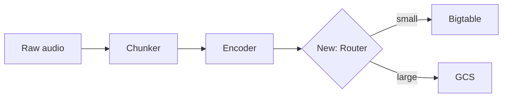
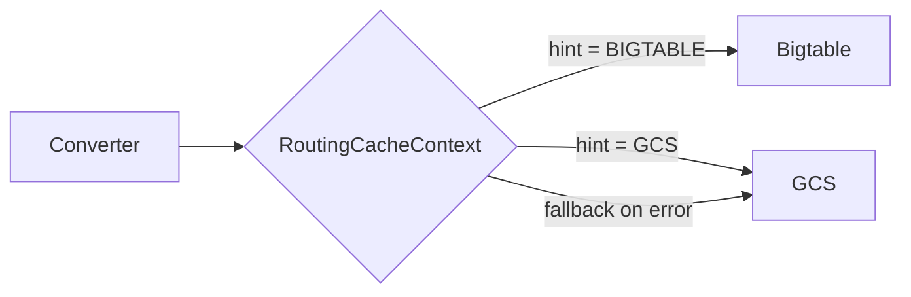

# Creating & updating pull requests

A PR description manages a reviewer's attention. Optimize for review speed: orient the reviewer in 30 seconds, answer "what changed, why, and where do I start reading?" before they open the diff.

# Critical rules

ALWAYS:
- Create PRs in draft mode (`--draft`). The user will mark them ready for review.

NEVER:
- Add `Co-Authored-By` headers on commits.
- Include "Generated with Claude Code" or any AI/Claude attribution.
- Mention Claude, AI, agents, or assistants anywhere in the PR.
- Open a sentence with "This PR introduces/adds/implements...", "In this pull request...", or "This change...". Start with the problem, the action, or the component name.

# Load PROSE.md before drafting

If `~/.claude/PROSE.md` exists, read it before writing the description. PR descriptions are prose; the rules there apply directly. Most load-bearing for PRs:

- **Active voice, present tense.** "X overrides Y" not "Y is overridden by X."
- **Omit needless words.** Cut "in order to", "the fact that", hedges like "rather", "quite", "very".
- **Front-load keywords.** Put the most important word in the first two words of each paragraph and header.
- **Bold sparingly (Von Restorff).** One bolded headline per Reviewer-notes bullet. If you bold everything, nothing stands out.
- **Concrete > abstract.** "showed `71 / 113  63%` instead of `71 / 160  44%`" lands harder than "showed an inflated percentage."
- **Paragraphs 2–4 lines.** Long blocks get skipped; one-line fragments fragment.
- **No "In conclusion", "Overall", "In summary".** End with a next step or a final fact.

# Size gate — classify before you draft

This is the single most important rule. A small PR with a verbose multi-section description is the fastest way to trigger "I'll ignore this LLM-generated description." Classify by `git diff --stat` and lock in a section budget before writing a single word.

**Small (< 50 lines, one concern):** TL;DR + Links. That's it. Fold any non-obvious reviewer note into the TL;DR as a trailing sentence. No files table (the diff is the map), no Why, no How, no Tests. If the description is longer than the diff, you've over-described.

**Medium (50–200 lines):** TL;DR + files table + at most two more sections that earn their space. The How section must describe a *design pattern* across files, not a per-file tour — if it reads like the files table with more words, cut it.

**Large (200+ lines or multiple concerns):** Use every section that applies. The files table and Reviewer notes are mandatory.

**The budget rule:** for small and medium PRs, the description body (excluding the files table) must be shorter than the diff. If it isn't, you're restating the diff in prose.

# Title format

Active voice, present tense, full scope.

| Good | Bad |
|------|-----|
| Add user authentication | Added user authentication |
| Fix memory leak in cache | Fixing memory leak |
| Use Redis for session lookup instead of DB query | Update session.py |

Pattern: `<Verb> <what> [in/for/to <context>]`

Common verbs: Add, Fix, Update, Remove, Refactor, Improve, Replace, Enable, Disable, Use, Make.

### Noun stacking — hard cap at two consecutive nouns

More than two consecutive nouns creates a garden-path sentence — the reader backtracks to parse it. If the title has a cluster of three or more nouns, rewrite before proceeding.

**Read-aloud test:** if you wouldn't say the title naturally in conversation, rewrite it.

| Bad (garden path) | Good (reads left-to-right) |
|---|---|
| Add Tingle check-posting observability for executor drain diagnosis | Add counters to Tingle check posts to diagnose slow executor drain |
| Fix converter cache routing threshold boundary validation | Fix boundary check in converter cache routing |
| Update model config diff summary generation error handling | Handle errors when generating model config diff summaries |
| Fix listening test Slack notifications lost on pipeline retry | Fix lost Slack notifications for listening tests after pipeline retry |

# The above-the-fold contract

A reviewer reads top-down and decides where to invest attention. Everything before the first scroll must orient them completely:

1. **Title** → full scope in one line. A reviewer who reads only the title should know what area of the codebase changed and what kind of change it is.
2. **TL;DR** → symptom + fix in two sentences, with a concrete number or example. A reviewer who reads only the TL;DR should be able to approve a low-risk PR without scrolling further.
3. **Files table** → where to start reading and why each file matters. A reviewer who reads the files table should know the review order and what to look for in each file.

If the TL;DR can't fit in two clean sentences, you don't yet understand the PR well enough. Re-read the diff.

# Description template

One template, flexible sections. Use every section that adds value; skip any that doesn't. The rule: **if removing a section wouldn't slow down the reviewer, remove it.**

```markdown
## TL;DR

[Two sentences. First names the problem with a concrete number, error, or example.
Second names what the PR does about it.]

**Files to review (N, +X / -Y):**

| File | Why |
|---|---|
| `path/to/start_here.py` *(start here)* | One-line pointer to the natural entry point. |
| `path/to/other.py` | Short reason this file changed. |

## Why

[Why the PR exists. Show the problem: error messages, wrong output, missing
capability. Use a before/after table or screenshot if the difference is visual
or numeric. Skip when the TL;DR already covers the "why" completely.]

## How

[The change, top-down. Numbered steps for sequential logic; bullets for parallel
changes. Focus on design decisions, not line-by-line narration.]

## Reviewer notes

[One bullet per non-obvious fact. Bold the headline of each. End with a
focus-area bullet when you want specific feedback.]

- **Match by `comparison_id`, not model pair.** Tier projects share pairs
  across tests, so matching by model pair would conflate results.
- **Falls back gracefully.** If the API call fails, logs and keeps the
  legacy denominator — no silent breakage.
- **Focus area:** routing logic is straightforward; I want a second
  opinion on the fallback behavior under concurrent writes.

## Visual aids

[Include when they earn their space. See "When to use visual aids" below.
Use collapsible sections for supporting evidence.]

## Tests

[What's covered, what isn't, how to run them.]

## Follow-up

[Out-of-scope work this PR sets up. Only if deliberately incomplete.]

## Links

- [Ticket](url)
- [Slack thread](url)
```

# Don't repeat the diff

The diff is right there. The description's job is to explain what the diff *can't* show: motivation, tradeoffs, context that lives outside the code.

### Cut these every time

- **File-by-file narration.** "In `foo.py`, changed X. In `bar.py`, changed Y." The files table and diff cover this.
- **Implementation play-by-play.** "First, I added a helper function. Then I called it from…" Describe the design, not the steps you took.
- **Motivation the reviewer already knows.** If the ticket fully explains the problem, link it and write one sentence.
- **Restating obvious type/signature changes.** "Changed `foo(x: int)` to `foo(x: float)`" — say *why* it changed.
- **Defensive disclaimers.** "This is a first pass", "open to suggestions." Put specific questions in Reviewer notes as a focus area instead.
- **Commit-message archaeology.** "In the first commit I did X, then in the second…" Describe the final state.

### The test: does this sentence exist in the diff?

For every sentence, ask: could a reviewer learn this by reading the diff? If yes, cut it. The description is the *complement* of the diff, not a summary.

# Avoiding AI tells

A single AI pattern isn't damning. Multiple patterns stacking together — that clustering is what triggers "I'm ignoring this LLM-generated description." Avoid clustering.

### Openers

Never start a sentence with "This PR", "This change", "This commit", or "In this pull request." Start with the subject of the action, the problem, or a concrete fact.

| AI opener | Human opener |
|---|---|
| This PR adds retry logic to... | Retry logic in the ingestion pipeline now... |
| This change fixes a bug where... | The chunker produced a zero-length trailing chunk when... |
| In this pull request, we update... | `RoutingCacheContext` now routes small features to Bigtable. |

### Concrete specificity

Concrete numbers and specific examples are the strongest trust signal. Use them everywhere, not just the TL;DR.

| Vague (reads as AI) | Specific (reads as human) |
|---|---|
| improved performance significantly | p50 dropped from 45 ms to 3 ms |
| fixed an edge case in validation | fixed boundary check: 49 kB routes to Bigtable, 51 kB to GCS |
| updated error handling | catch `ServiceUnavailable` instead of bare `Exception` |

### Variety

Vary section openings, sentence lengths, and structures. If every bullet in Reviewer notes starts with a bold word followed by a period and explanation, that regularity itself becomes a tell. Mix it up: some bullets lead with a question the reviewer might ask, some with a constraint, some with a concrete example.

### Self-contained context

The PR description is permanent project documentation. Companies migrate issue trackers; git history persists. Inline essential context directly — use links for depth, not as the sole reference. A description that says only "See JIRA-123" forces a context switch and may be unresolvable in two years.

### The 6-month test

Before finishing, ask: if a stranger revisits this PR in 6 months through `git log`, will they understand why the change was made? If not, add the missing context.

# When to use visual aids

Visual aids earn their space when they communicate something faster than prose. Don't decorate — illustrate.

### Before/after tables

Use when the PR changes observable behavior (output format, API response shape, metric values, error messages).

```markdown
| | Before | After |
|---|---|---|
| Progress display | `71 / 113  63%` | `71 / 160  44%` |
| Completion trigger | Fires at 113 annotations | Fires at 160 annotations |
```

### Mermaid diagrams

Use when the PR changes data flow, adds a pipeline stage, or restructures component interactions. Don't diagram things that haven't changed. Keep under ~15 nodes.

````markdown

````

### Code snippets

Use when the PR changes a public API surface and the reviewer needs to see the new call site without hunting through the diff.

### Screenshots / terminal output

Use for UI changes, CLI output changes, or log format changes. Paste directly.

### Collapsible sections

Use `<details>/<summary>` for supporting evidence: benchmarks, migration plans, full tracebacks, large config diffs. The PR must be fully understandable without expanding anything.

```markdown
<details>
<summary>Performance benchmarks</summary>

| Operation | Before (GCS) | After (Bigtable) |
|-----------|-------------|-------------------|
| Read 1 kB feature | 45 ms | 8 ms |
| Read 100 kB feature | 52 ms | 51 ms (still GCS) |

</details>
```

Rules: always include a `<summary>` with a descriptive label. Blank line after `<summary>` and before `</details>` for markdown to render. Don't collapse the core "what and why."

### GFM alerts

Use `> [!IMPORTANT]` or `> [!WARNING]` for breaking changes, migration requirements, or facts a reviewer must not miss. More visually distinct than bold text.

```markdown
> [!IMPORTANT]
> Cache key format changes. Existing entries remain valid but new writes
> go to Bigtable for features under 50 kB.
```

### When NOT to use visual aids

- Purely internal changes (refactor, rename, test-only).
- The "before" state is obvious. A before/after table for a one-line fix is overhead.
- You're diagramming the whole system. Scope diagrams to what the PR *changes*.

# Reviewer-friendliness checklist

Before submitting, verify:

- [ ] **Size gate** → section count matches the diff size classification.
- [ ] **Title** → full scope, active voice, no noun clusters > 2.
- [ ] **TL;DR** → symptom + fix, concrete number or example.
- [ ] **No AI openers** → no sentence starts with "This PR", "This change", or "In this pull request."
- [ ] **No diff echoing** → every sentence tells the reviewer something the diff can't.
- [ ] **Files table** → marks a "start here" entry point (medium+ PRs).
- [ ] **Focus area** → stated explicitly if specific feedback is wanted.
- [ ] **Visual aids** → present where faster than prose, absent where decorative.
- [ ] **6-month test** → a stranger reading `git log` would understand the why.

# Process

## 1. Detect: create or update?

```bash
gh pr view --json number,title,body,baseRefName,url 2>/dev/null
```

## 2. Gather context

```bash
BASE=$(gh pr view --json baseRefName -q '.baseRefName' 2>/dev/null || echo "main")

git diff $BASE...HEAD          # full diff
git diff $BASE...HEAD --stat   # shape: files, +/- counts
git log $BASE..HEAD --oneline  # commits
```

Read the actual diff, not just the stat. The description must reflect what the code does now.

## 3. Find links

Search for supporting evidence — don't ask the user for what you can find:
- `git log --all --oneline --grep="keyword"` for related PRs and reverts
- Slack search for error messages or feature names
- Issue tracker for tickets referencing the area
- Branch name and commits for embedded ticket numbers

Inline essential context directly. Link for depth, not as the sole reference. When updating, preserve every existing link.

## 4. Classify and draft

Check `git diff --stat` line count. Apply the size gate to lock in which sections you'll write *before* drafting. If the PR is small, write the TL;DR and stop — don't keep going because the template has more sections.

Sketch the TL;DR first — it forces clarity. Then fill in only the sections the size gate allows. Apply PROSE.md rules throughout.

## 5. Post-generation review

Re-read the diff one more time. For each sentence in the description:
1. Could the reviewer learn this from the diff alone? Cut it.
2. Does it start with "This PR" or "This change"? Rewrite.
3. Is this section earning its space for a PR this size? Cut the section.
4. Would you say this sentence out loud to a colleague? If not, simplify.

## 6. Apply

Write the body to a temp file, then pass it with `--body-file`. This avoids shell escaping issues with backticks and markdown.

```bash
# Create — always draft
gh pr create --draft --title "..." --body-file /tmp/pr-body.md

# Update
gh pr edit <number> --title "..." --body-file /tmp/pr-body.md
```

**Never** pass the body inline via HEREDOC or `--body`.

# Updating an existing PR

The description must reflect the **current full state** of the branch vs base — not a changelog. Drop "also adds", "additionally", "now includes." Describe what the PR does as if writing it fresh.

# Worked examples

## Small PR: one-concern bug fix (~20 lines)

Title: `Fix off-by-one in chunk boundary calculation`

```markdown
## TL;DR

Chunking a 10-second stereo clip at 5-second boundaries produced three chunks
instead of two — the boundary loop used `<=` instead of `<`, generating a
zero-length trailing chunk. Now uses exclusive end indices.

[DIFF-1234](url)
```

That's the entire description. The diff is 20 lines — everything else the reviewer needs is in the code.

## Small PR: additive config registration (~30 lines)

Title: `Register foundation model preference axes in analysis pipeline`

```markdown
## TL;DR

Foundation model listening tests (project `257473`) use three preference
questions — `composition`, `fidelity`, `sound-design` — that the analysis
pipeline silently drops. Registers them in the four places the pipeline
checks. **No migration needed:** BQ uses `ALLOW_FIELD_ADDITION`; Cloud SQL
stores preferences as JSONB.

Complements `venice/foundation-listening-test` (test creation side).
```

## Non-trivial PR with visual aids and focus area

Title: `Route small converter outputs to Bigtable instead of GCS`

```markdown
## TL;DR

Converter cache reads for small features (< 50 kB) hit GCS with per-object
latency — p50 of 45 ms adds up to ~8 minutes per preprocessing job on a
10k-track dataset. `RoutingCacheContext` sends small features to Bigtable
(p50: 3 ms) and keeps large features on GCS.

**Files to review (5, +287 / -34):**

| File | Why |
|---|---|
| `core/utils/caching.py` *(start here)* | New `RoutingCacheContext` — all routing logic lives here. |
| `core/constants.py` | `FeatureSizeHint` enum and Bigtable constants. |
| `converters/base.py` | Converters declare `feature_size_hint`. |
| `tests/.../test_routing_cache.py` *(new)* | 12 tests covering routing, fallback, and threshold edge cases. |
| `kubernetes/bigtable/bigtable.yaml` | Column family for converter cache. |

## Why

| | GCS (current) | Bigtable (this PR) |
|---|---|---|
| p50 read latency | 45 ms | 3 ms |
| 10k-track job overhead | ~8 min | ~30 sec |
| Cost per 1M reads | $0.50 | $0.12 |

Small features (audio metadata, caption embeddings) are 2–30 kB — well under
Bigtable's 10 MB cell limit and a poor fit for GCS's per-object overhead.

## How

1. Converters declare `feature_size_hint = FeatureSizeHint.BIGTABLE` or `.GCS`.
2. `RoutingCacheContext` wraps both backends.
3. On read/write, routes by the converter's declared hint.



## Reviewer notes

- **Fallback on Bigtable failure.** The router retries once, then falls back
  to GCS and logs a warning. Reads check both backends.
- **Threshold is declared, not measured.** Converters declare their hint
  statically — runtime size checks would add latency for marginal benefit.
- No migration needed: existing GCS entries stay; new writes route by hint.
- **Focus area:** the fallback logic in `RoutingCacheContext.write()` handles
  concurrent writes. I'd like a second opinion on the retry semantics.

> [!IMPORTANT]
> Cache key format is unchanged. Existing GCS entries remain valid.

<details>
<summary>Bigtable capacity planning</summary>

Current converter cache: ~2M entries/day, 95% under 50 kB. Bigtable cluster
(3 nodes, SSD) handles 10K reads/sec at p99 < 10 ms. Headroom: 5x current
peak before scaling.

</details>

## Links

- [DIFF-5678](url)
- [Bigtable capacity planning doc](url)
```
