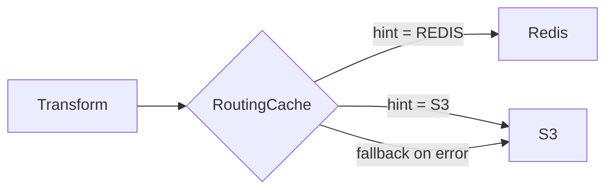

# Creating & updating pull requests

A PR description transfers the author's understanding to the reviewer. The author spent hours building a mental model of the problem and solution. The description compresses that model into something a reviewer absorbs in minutes.

## Critical rules

ALWAYS:
- Create PRs in draft mode (`--draft`). The user will mark them ready for review.

NEVER:
- Add `Co-Authored-By` headers on commits.
- Include "Generated with Claude Code" or any AI/Claude attribution.
- Mention Claude, AI, agents, or assistants anywhere in the PR.
- Open a sentence with "This PR introduces/adds/implements...", "In this pull request...", or "This change...". Start with the problem, the action, or the component name.

## Enforce PROSE.md

Read `~/.claude/PROSE.md` before drafting. Apply every rule. The most common violations in PR descriptions:

- Passive voice. "Y is overridden by X" → "X overrides Y."
- Needless words. Cut "in order to", "the fact that", hedges like "rather", "quite", "very".
- Puffery and AI slop. No "robust", "comprehensive", "seamless", "streamline", em dashes, throat-clearing ("Here's the thing"), emphasis crutches ("Full stop"), filler adverbs ("At its core", "It's worth noting").
- Front-load keywords. The first two words of each paragraph and header carry the most weight.
- Bold sparingly (Von Restorff). One bolded headline per Reviewer-notes bullet. If everything is bold, nothing stands out.
- Paragraphs 2–4 lines. Long blocks get skipped; one-line fragments fragment.
- No "In conclusion", "Overall", "In summary". End with a next step or a final fact.

After drafting, re-read against PROSE.md and cut violations. Every sentence should pass the spoken word test: would you say it out loud to a colleague?

## Size gate — classify before you draft

A small PR with a verbose multi-section description signals "AI-generated, ignore." Classify by `git diff --stat` and lock in a section budget before writing a word.

**Small (< 50 lines, one concern):** TL;DR + Links. No files table, no How, no Tests. If the description is longer than the diff, cut.

**Medium (50–200 lines):** TL;DR + files table + at most two more sections that earn their space.

**Large (200+ lines or multiple concerns):** Use every section that applies. Files table and Reviewer notes are mandatory.

**The budget rule:** for small and medium PRs, the description body (excluding the files table) must be shorter than the diff.

## Motivation is not optional

Every PR, regardless of size, must answer **why the change exists**. Even a 20-line fix has a reason — a bug report, a production incident, a prerequisite for future work, a code path that was wrong. The "why" is the single most important thing reviewers need. Without it, they can evaluate whether the code compiles but not whether it solves the right problem.

For small PRs, fold the motivation into the TL;DR as the first sentence. For medium+ PRs, use the Why section when the TL;DR can't carry the full context.

### When you don't have the motivation

You are an agent — you may lack context the author has. If you cannot derive the "why" from the diff, commit messages, branch name, linked tickets, or conversation history, **ask**. Use AskUserQuestion:

- "What problem does this solve?" or "What was broken / missing / slow before this change?"
- "Is this a prerequisite for other work? What does it unblock?"
- "Was there a specific incident, request, or design decision that led here?"

A fabricated motivation is worse than no motivation. If the user declines to provide context, write the TL;DR without a "why" and note the gap — don't invent one.

## Conceptual frame before mechanics

Before drafting, answer one question: **what will the reviewer understand differently after reading this description?** That answer is the organizing principle for everything you write.

The description should give the reviewer enough context to predict what the diff looks like before they open it. If they open the diff and are surprised by the shape of the changes, the description failed.

For the How section: describe the *design pattern* across the change, not a per-file tour. Lead with the conceptual insight ("requests under the threshold use the fast path; everything else takes the batch path") then support with specifics. If the How reads like the files table with more words, cut it.

### Surface design decisions

The diff shows what you chose. The description explains what you chose *against* and why. For medium+ PRs:

- Preemptively answer "why not X?" for non-obvious choices.
- Name alternatives you considered and why you rejected them.
- Acknowledge shortcomings in the chosen approach.

These are things the diff literally cannot convey.

### State scope boundaries

Tell the reviewer what is NOT in scope: "Focuses on the login flow; sign-up is a follow-up." Prevents reviewers from flagging missing pieces that are intentionally deferred. For small PRs, one trailing sentence in the TL;DR. For large PRs, integrate into the Why or Follow-up section.

## Title format

Active voice, present tense, full scope.

| Good | Bad |
|------|-----|
| Add user authentication | Added user authentication |
| Fix memory leak in cache | Fixing memory leak |
| Use Redis for session lookup instead of DB query | Update session.py |

Pattern: `<Verb> <what> [in/for/to <context>]`

### Noun stacking — hard cap at two consecutive nouns

Three or more consecutive nouns creates a garden-path sentence. Read-aloud test: if you wouldn't say the title in conversation, rewrite.

| Bad (garden path) | Good (reads left-to-right) |
|---|---|
| Add health-check posting observability for executor drain diagnosis | Add counters to health-check posts to diagnose slow executor drain |
| Fix request cache routing threshold boundary validation | Fix boundary check in request cache routing |

## The above-the-fold contract

Everything before the first scroll orients the reviewer completely:

1. **Title** → full scope in one line.
2. **TL;DR** → motivation + approach in two sentences. First sentence: the problem (with a concrete number, error, or example when available). Second sentence: what the PR does about it.
3. **Files table** → where to start reading and why each file matters.

If the TL;DR can't fit in two clean sentences, you don't yet understand the PR well enough. Re-read the diff.

## Description template

Use every section that adds value; skip any that doesn't. If removing a section wouldn't slow down the reviewer, remove it.

```markdown
## TL;DR

[Two sentences. First: the problem or motivation, concrete where possible.
Second: what the PR does about it.]

**Files to review (N, +X / -Y):**

| File | Why |
|---|---|
| `path/to/start_here.py` *(start here)* | Entry point for the change. |
| `path/to/other.py` | Short reason this file changed. |

## Why

[The problem in detail. Show the failure: error messages, wrong output, missing
capability. Use a before/after table or screenshot if the difference is visual
or numeric. Skip when the TL;DR already covers the "why" completely.]

## How

[The design pattern across the change. Lead with the conceptual insight,
then support with specifics. Name alternatives considered for non-obvious
choices. Focus on what the diff can't show.]

## Reviewer notes

[One bullet per non-obvious fact. Bold the headline of each.]

- **Match by `session_id`, not user pair.** Shared sessions reuse pairs
  across experiments, so matching by user pair conflates results.
- **Focus area:** routing logic is straightforward; I want a second
  opinion on the fallback behavior under concurrent writes.

## Visual aids

[Include when they earn their space. See "When to use visual aids" below.]

## Tests

[What's covered, what isn't, how to run them.]

## Follow-up

[Out-of-scope work this PR sets up. Only if deliberately incomplete.]

## Links

- [Ticket](url)
```

## Don't repeat the diff

The diff is right there. The description explains what the diff *can't* show: motivation, tradeoffs, context outside the code.

### Cut these every time

- **File-by-file narration.** The files table and diff cover this.
- **Implementation play-by-play.** Describe the design, not the steps you took.
- **Restating obvious type/signature changes.** Say *why* it changed.
- **Defensive disclaimers.** Put specific questions in Reviewer notes as a focus area.
- **Commit-message archaeology.** Describe the final state.

### The test: does this sentence exist in the diff?

For every sentence: could a reviewer learn this from the diff? If yes, cut it. The description complements the diff, not summarizes it.

## Avoiding AI tells

Multiple AI patterns stacking together triggers "I'm ignoring this LLM-generated description." Avoid clustering.

### Openers

Never start a sentence with "This PR", "This change", "This commit", or "In this pull request."

| AI opener | Human opener |
|---|---|
| This PR adds retry logic to... | Retry logic in the ingestion pipeline now... |
| This change fixes a bug where... | The chunker produced a zero-length trailing chunk when... |

### Concrete specificity

Concrete numbers and specific examples are the strongest trust signal.

| Vague | Specific |
|---|---|
| improved performance significantly | p50 dropped from 45 ms to 3 ms |
| fixed an edge case in validation | fixed boundary check: 49 kB takes the fast path, 51 kB goes to cold storage |

### Self-contained context

The PR description is permanent documentation. Companies migrate issue trackers; git history persists. Inline essential context — use links for depth, not as the sole reference. A description that says only "See JIRA-123" may be unresolvable in two years.

## When to use visual aids

Visual aids earn space when they communicate faster than prose.

**Before/after tables** — when the PR changes observable behavior (output format, metric values, error messages).

**Mermaid diagrams** — when the PR changes data flow or component interactions. Don't diagram things that haven't changed. Keep under ~15 nodes.

**Code snippets** — when the PR changes a public API surface and the reviewer needs to see the new call site.

**Screenshots / terminal output** — for UI, CLI output, or log format changes.

**Collapsible sections** — `<details>/<summary>` for supporting evidence: benchmarks, tracebacks, large config diffs. The PR must be understandable without expanding anything. Always include a `<summary>` with a descriptive label.

**GFM alerts** — `> [!IMPORTANT]` or `> [!WARNING]` for breaking changes or facts a reviewer must not miss.

**When NOT to use** — purely internal changes, one-line fixes where "before" is obvious, diagrams of the whole system rather than what changed.

## Verbosity check

After drafting, apply these cuts:

1. Re-read every sentence. If it restates the diff, cut it.
2. If a section repeats what another section says, cut the weaker one.
3. If a paragraph exceeds 4 lines, split or trim.
4. If the whole description exceeds the budget rule, cut sections bottom-up (Follow-up first, then Tests, then Visual aids).
5. Read the final description aloud. If any sentence makes you wince, rewrite it shorter.

The best description is the shortest one that transfers the author's understanding.

## Process

### 1. Detect: create or update?

```bash
gh pr view --json number,title,body,baseRefName,url 2>/dev/null
```

### 2. Gather context

```bash
BASE=$(gh pr view --json baseRefName -q '.baseRefName' 2>/dev/null || echo "main")

git diff $BASE...HEAD          # full diff
git diff $BASE...HEAD --stat   # shape: files, +/- counts
git log $BASE..HEAD --oneline  # commits
```

Read the actual diff, not just the stat.

### 3. Derive motivation

Before writing, establish the "why":

1. Check the diff and commit messages for problem context.
2. Check the branch name and commits for ticket numbers.
3. Search git history and conversation context for related PRs, incidents, or discussions.
4. **If the motivation is still unclear, ask the user.** Use AskUserQuestion with specific prompts: "What problem does this solve?", "What was broken before?", "Is this a prerequisite for other work?"

Do not fabricate motivation. Do not write "Improves code quality" or "Cleans up technical debt" as generic filler.

### 4. Classify and draft

Check `git diff --stat` line count. Apply the size gate. If the PR is small, write the TL;DR and stop.

Sketch the TL;DR first — it forces clarity. Then fill in only the sections the size gate allows.

### 5. Post-generation review

Re-read the diff, then re-read PROSE.md, then review each sentence:

1. Could the reviewer learn this from the diff alone? Cut it.
2. Does it start with "This PR" or "This change"? Rewrite.
3. Is this section earning its space for a PR this size? Cut the section.
4. Does any sentence violate PROSE.md (passive voice, puffery, em dashes, filler adverbs)? Fix it.
5. Is the description shorter than the diff (for small/medium PRs)? If not, keep cutting.

### 6. Apply

Write the body to a temp file, then pass it with `--body-file`.

```bash
# Create — always draft
gh pr create --draft --title "..." --body-file /tmp/pr-body.md

# Update
gh pr edit <number> --title "..." --body-file /tmp/pr-body.md
```

**Never** pass the body inline via HEREDOC or `--body`.

## Updating an existing PR

The description reflects the **current full state** of the branch vs base — not a changelog. Drop "also adds", "additionally", "now includes." Describe what the PR does as if writing it fresh.

## Worked examples

### Small PR: one-concern bug fix (~20 lines)

Title: `Fix off-by-one in chunk boundary calculation`

```markdown
## TL;DR

Chunking a 10-second stereo clip at 5-second boundaries produced three chunks
instead of two — the boundary loop used `<=` instead of `<`, generating a
zero-length trailing chunk. Now uses exclusive end indices.

[PROJ-1234](url)
```

The motivation ("three chunks instead of two") and the fix ("exclusive end indices") are both in the TL;DR. No other sections needed.

### Small PR: additive config registration (~30 lines)

Title: `Register survey response fields in analytics pipeline`

```markdown
## TL;DR

Survey responses for project `survey-v2` include three new fields
(`satisfaction`, `effort`, `likelihood`) that the analytics pipeline
silently drops. Registers them in the four places the pipeline checks.
No migration needed: the warehouse uses schema auto-detection; the
application DB stores responses as JSONB.

Complements `survey-v2/response-collection` (data capture side).
```

### Non-trivial PR with design decisions and focus area

Title: `Route small cache entries to Redis instead of S3`

```markdown
## TL;DR

Cache reads for small entries (< 50 kB) hit S3 with per-object latency.
p50 of 45 ms adds up to ~8 minutes per batch job on a 10k-item dataset.
`RoutingCache` sends small entries to Redis (p50: 3 ms) and keeps large
entries on S3.

**Files to review (5, +287 / -34):**

| File | Why |
|---|---|
| `lib/cache/routing.py` *(start here)* | New `RoutingCache` — all routing logic lives here. |
| `lib/constants.py` | `SizeHint` enum and Redis config constants. |
| `lib/transforms/base.py` | Transforms declare `size_hint`. |
| `tests/.../test_routing_cache.py` *(new)* | 12 tests covering routing, fallback, and threshold edge cases. |
| `infra/redis.yaml` | Key namespace for transform cache. |

## Why

| | S3 (current) | Redis (this PR) |
|---|---|---|
| p50 read latency | 45 ms | 3 ms |
| 10k-item job overhead | ~8 min | ~30 sec |
| Cost per 1M reads | $0.50 | $0.12 |

Small entries (metadata, embeddings) are 2–30 kB — a poor fit for S3's
per-object overhead.

## How

Transforms declare a size hint (`REDIS` or `S3`). `RoutingCache` wraps both
backends and routes by hint. Runtime measurement was considered but rejected:
it would add latency on every write for marginal benefit over static
declaration, since transform output sizes are stable.


```mermaid
graph LR
    T[Transform] --> R{RoutingCache}
    R -->|hint = REDIS| D[Redis]
    R -->|hint = S3| S[S3]
    R -->|fallback on error| S
```

## Reviewer notes

- **Fallback on Redis failure.** Retries once, then falls back to S3
  and logs a warning. Reads check both backends.
- No migration needed: existing S3 entries stay; new writes route by hint.
- **Focus area:** the fallback logic in `RoutingCache.write()` handles
  concurrent writes. I'd like a second opinion on the retry semantics.

> [!IMPORTANT]
> Cache key format unchanged. Existing S3 entries remain valid.

<details>
<summary>Redis capacity planning</summary>

Current cache: ~2M entries/day, 95% under 50 kB. Redis cluster
(3 nodes) handles 10K reads/sec at p99 < 10 ms. Headroom: 5x current
peak before scaling.

</details>

## Links

- [PROJ-5678](url)
- [Redis capacity planning doc](url)
```
